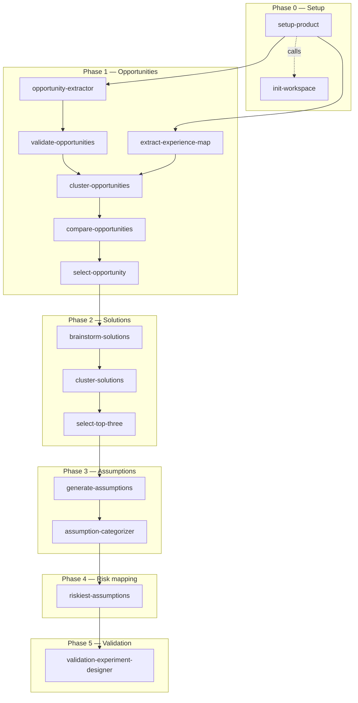

# product-discovery

Claude Code plugin for **Opportunity Solution Tree (OST)** discovery, based on Teresa Torres' Continuous Discovery Habits framework. Guides a product trio (PM, UX designer, tech lead) from experience mapping through opportunity selection, solution brainstorming, assumption testing, and validation experiment design.

## Install

Requires the `scilla-studio` marketplace (private repo — needs `gh auth login`):

```
/plugin marketplace add scilla-studio-stockholm/claude-plugins
/plugin install product-discovery@scilla-studio
```

Updates pull automatically on session start (`autoUpdate: true`). Force-update mid-session:

```
/plugin update product-discovery@scilla-studio
```

## Skill flow



## Skills

The plugin ships 15 skills organized into five phases. Each skill outputs paired JSON + markdown (and sometimes HTML) that feeds into the next.

### Phase 0 — Setup

| Skill | What it does |
|---|---|
| `OST-setup-product` | Guided entrypoint. Walks the trio through product outcome, experience map, and opportunity citation to scaffold a ready-to-use `discovery/` workspace. Start here. |
| `OST-init-workspace` | Low-level scaffolding. Adds product, opportunity, or selection-round folders to an existing workspace. Called by `OST-setup-product` under the hood. |

### Phase 1 — Opportunities

| Skill | What it does |
|---|---|
| `OST-extract-experience-map` | Extracts a screenshot of an experience map into structured JSON + markdown (phases, steps, friction, decision branches). |
| `OST-opportunity-extractor` | Reads cleaned interview transcripts and pulls out verbatim customer-voice citat-stickies (pain, friction, unmet need, workaround). |
| `OST-validate-opportunities` | Quality-checks opportunities: approved, needs tweak, or solution in disguise. |
| `OST-cluster-opportunities` | Tags each opportunity to an experience-map phase/step and groups them into parent-child clusters. |
| `OST-compare-opportunities` | Scores all opportunities on 5 Torres criteria against the product outcome. Outputs a full matrix (JSON + markdown) and a swim-lane HTML card view for skimming at scale. |
| `OST-select-opportunity` | Proposes one opportunity to carry forward with rationale, alternatives considered, and evidence gaps. |

### Phase 2 — Solutions

| Skill | What it does |
|---|---|
| `OST-brainstorm-solutions` | Generates 18 divergent solution candidates via three role-diversified sub-agents (PM, UX, Tech Lead) over three rounds. |
| `OST-cluster-solutions` | Groups the 18 candidates into 3-5 thematic clusters. |
| `OST-select-top-three-solutions` | Picks the top 3 solutions ranked by outcome-impact probability. |

### Phase 3 — Assumptions

| Skill | What it does |
|---|---|
| `OST-generate-assumptions` | Decomposes top 3 solutions into assumptions via storymap, pre-mortem, and outcome-impact passes. |
| `OST-assumption-categorizer` | Tags each assumption into one of Cagan's five product-risk categories. |

### Phase 4 — Risk mapping

| Skill | What it does |
|---|---|
| `OST-riskiest-assumptions` | Scores assumptions on Bland's importance x evidence 2x2 and flags the riskiest (high importance, weak evidence). |

### Phase 5 — Validation

| Skill | What it does |
|---|---|
| `OST-validation-experiment-designer` | Designs a Bland Test Card per riskiest assumption (hypothesis, test, metric, success criteria) plus 2 alternative tests. Terminal skill — the trio picks execution order and runs. |

## Knowledge base

The `knowledge/` folder provides grounding material the skills reference at runtime:

- **`discovery/`** — Schemas and methodology for each OST phase (experience mapping, opportunity comparison, solution brainstorm, assumption generation, etc.)
- **`foundations/`** — Product operating model (Cagan), trio roles and responsibilities, operational practices

## Methodology sources

- Teresa Torres — *Continuous Discovery Habits* (OST framework, opportunity selection criteria)
- Marty Cagan — *Inspired* / *Empowered* (product operating model, five risk categories)
- David Bland — *Testing Business Ideas* (assumption risk mapping, Test Cards)

## Structure

```
product-discovery/
  .claude-plugin/plugin.json
  knowledge/
    discovery/          # phase-specific schemas and methodology
    foundations/        # product model and trio role definitions
  skills/
    00a-OST-init-workspace/
    00b-OST-setup-product/
    01-OST-extract-experience-map/
    ...
    13-OST-validation-experiment-designer/
```

Folder numeric prefixes are for human navigation. The `name:` field in each skill's `SKILL.md` is the canonical identifier used for invocation.
