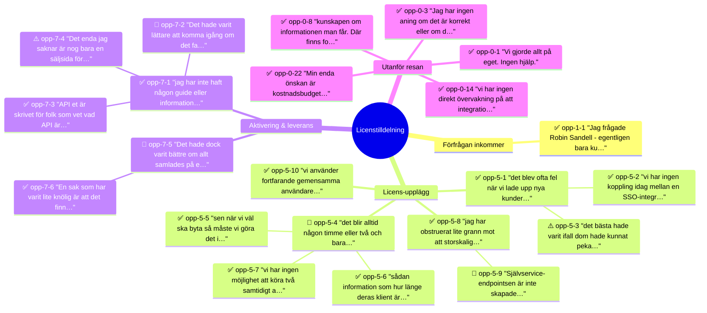

# Experience map (clustered): Licenstilldelning (Aurora)

Source experience map: `experience-map-extracted.json`
Source validated opportunities: `opportunities-validated.md`
Source extracted opportunities: `opportunities-extracted.md`
Schema version: 0.2
Paired JSON: `experience-map-clustered.json`

## Product outcome

Öka andelen nya kunder som på egen hand når sitt första lyckade produktionsanrop mot API:et utan att kontakta Flowbase, från 40% till 80% inom 60 dagar från avtalstecknande.

## Narrativ

Idag är det svårt och resurskrävande att erbjuda och skala våra API-licenser. Processen för behörighetsgivning är komplex och innebär hög risk för fel, vilket leder till att både utvecklings- och supportinsatser blir omfattande. Som konsekvens undviker vi i praktiken att sälja API-licenser, trots att det finns efterfrågan, eftersom vi inte har kapacitet att hantera alla potentiella kunder.

## Clustering summary

- Phases with opportunities: 3 of 7 (+ fas-0-unphased)
- Opportunities per phase: Förfrågan inkommer: 1, Licens-upplägg: 10, Aktivering & leverans: 6
- Unphased: 27
- Verdicts: ✅ Approved 34, 🔧 Needs tweak 8, ⚠️ Solution in disguise 2

## Opportunity map

## Journey

### Fas 1: Förfrågan inkommer (friktion: low)

**Steg:**

- Inkommen förfrågan, offert, förnyelse/tillval. Kund eller säljare.
- Rabatt?
  - Branch: Ja → Säljare förhandlar rabatt
  - Branch: Nej → Fas 2
- Säljare förhandlar rabatt

**Opportunities (1):**

- ✅ **opp-1-1** "Jag frågade Robin Sandell - egentligen bara kundtjänst - om det var möjligt att hämta datan via API, istället för via webbsökningen. Och då skickade han de här XML-strängarna som innehåller all data." - *David, intervju-4-aurora-apr-13, ~rad 42* [steg: step-1-1]

### Fas 2: Behovsanalys & avtal (friktion: low)

**Steg:**

- Skickar avtal (Word) till kund per post i Freshdesk

_Inga opportunities klustrade till denna fas._

### Fas 3: Avtalsskrivning (friktion: medium)

**Steg:**

- Avtalsprocess
- Ny eller befintlig kund?
  - Branch: Ny → Lägg upp kund i SalesForce
  - Branch: Befintlig → Fas 4
- Lägg upp kund / Uppdatera kundinfo i SalesForce

_Inga opportunities klustrade till denna fas._

### Fas 4: Kreditkontroll & ekonomi (friktion: medium)

**Steg:**

- Kreditbetyg
  - Branch: Rating under 40 → Support gör kreditprövning via Credit Safe
  - Branch: Rating över 40 → Beställer faktureringsunderlag
- Support gör kreditprövning via Credit Safe
- Godkänd?
  - Branch: Nej → Meddela avslag till kund
  - Branch: Ja → Beställer faktureringsunderlag
- Beställer faktureringsunderlag. Ekonomi via e-post
- Färdigställer avtalet och laddar upp i SalesForce

_Inga opportunities klustrade till denna fas._

### Fas 5: Licens-upplägg (friktion: high)

**Steg:**

- API-flöde / SSO-flöde / Webb-flöde
  - Branch: API → Skapar avtal i Kärnprodukten Admin
  - Branch: SSO → Skapar avtal i Kärnprodukten Admin
  - Branch: Webb → Skapar avtal i Kärnprodukten Admin
- Skapar avtal i Kärnprodukten Admin med konfiguration, transaktioner och behörigheter
- Kopplar avtal och projekt för fakturering via Debiteringssystemet
- Lägger till abonnemangsavgift i Debiteringssystemet
- Skapar transaktionsanvändare i Keycloak
- Finns licenspaket i Licenshanteraren?
  - Branch: Ja → Tilldelar licens
  - Branch: Nej → Beställer nytt licenspaket
- Beställer nytt licenspaket från Aurora
- Tilldelar licens till kund utifrån licenspaket i Licenshanteraren
- Lägger till användare och licensadministratör för kund i Licenshanteraren

**Opportunities (10):**

- ✅ **opp-5-1** "det blev ofta fel när vi lade upp nya kunder — de fick inte alla behörigheter de behövde, vilket ledde till en hel del fram-och-tillbaka innan en kund var igång." - *Lina, intervju-3-aurora-apr-13, ~rad 42* [steg: step-5-2]
  - ✅ **opp-5-2** "vi har ingen koppling idag mellan en [SSO-]integration och en licens utan vi [...] hårdkodade behörigheterna kopplat [till] integrationen" - *Niklas, intervju-2-aurora-apr-09, ~rad 251* [steg: step-5-2]
  - ⚠️ **opp-5-3** "det bästa hade varit ifall [...] dom hade kunnat peka ut ja, men det här attributet eller den här grupptillhörigheten och så kopplar det till en licens [...] i självservice-gränssnittet" - *Niklas, intervju-2-aurora-apr-09, ~rad 271-275* [steg: step-5-2]
- 🔧 **opp-5-4** "det blir alltid det går alltid någon timme eller två och bara diskutera hur [man] för över den här [secret-]cykeln" - *Niklas, intervju-2-aurora-apr-09, ~rad 207* [steg: step-5-5]
  - ✅ **opp-5-5** "sen när vi väl ska byta så måste vi göra det i samförstånd med kunden så att dom vet att ingenting bara slutar fungera [...] det tar alltid några timmar och kan de bara göra det själv så är det mycket smidigare" - *Niklas, intervju-2-aurora-apr-09, ~rad 211* [steg: step-5-5]
  - ✅ **opp-5-6** "sådan information som hur länge [...] deras klient[secret] är giltig[t]. Det är ingenting vi systematiskt kan extrahera, utan det är information vi får via teams eller telefon." - *Niklas, intervju-2-aurora-apr-09, ~rad 295* [steg: step-5-5]
  - ✅ **opp-5-7** "vi har ingen möjlighet att köra två samtidigt aktiva [secrets] så att byt över den, ja, men då kommer det sluta funka för dom om dom inte har satt upp det på sin sida" - *Niklas, intervju-2-aurora-apr-09, ~rad 187* [steg: step-5-5]
- ✅ **opp-5-8** "jag har obstruerat lite grann mot att storskaligt gå ut och sälja [SSO-]integrationer just för att jag tycker inte att vi riktigt är redo för det" - *Niklas, intervju-2-aurora-apr-09, ~rad 239* [steg: step-5-1]
  - 🔧 **opp-5-9** "[Självservice-]endpointsen är inte skapade [...] Det finns i någon [...] epic eller nåt sånt [...] men det är inte implementerat" - *Niklas, intervju-2-aurora-apr-09, ~rad 159*
- ✅ **opp-5-10** "vi använder fortfarande gemensamma användare — vilket innebär att vi inte kan använda vissa funktioner i Datahubben, till exempel caching." - *Lina, intervju-3-aurora-apr-13, ~rad 44* [steg: step-5-5]

### Fas 6: Rabatter (friktion: high)

**Steg:**

- Rabatt avtalad?
  - Branch: Ja → Rabattprocess
  - Branch: Nej → Fas 7
- Petra/Karin beställer tillägg av rabatter via e-post till Olof. Uppdaterar rabatt-fil
- Olof räknar ut och fyller i rabattprislistan i Prisverktyget

_Inga opportunities klustrade till denna fas._

### Fas 7: Aktivering & leverans (friktion: low)

**Steg:**

- Skickar välkomstmail till kund med inloggningsuppgifter, prislista och lathund. Meddelar licensadministratör

**Opportunities (6):**

- ✅ **opp-7-1** "jag har inte haft någon guide eller information, och ni har ju också sagt att ni inte jobbar med att hjälpa till att implementera - det får kunden göra själv" - *David, intervju-4-aurora-apr-13, ~rad 58* [steg: step-7-1]
  - 🔧 **opp-7-2** "Det hade varit lättare att komma igång om det fanns någon typ av liten säljande startsida för vad man kan använda API:et till." - *David, intervju-4-aurora-apr-13, ~rad 60* [steg: step-7-1]
  - ✅ **opp-7-3** "API:et [är] skrivet för folk som vet vad API är - för dem är det inga konstigheter. Men vi som inte visste fick det att ta längre tid att leta sig fram än vad det hade behövt göra." - *David, intervju-4-aurora-apr-13, ~rad 61* [steg: step-7-1]
  - ⚠️ **opp-7-4** "Det enda jag saknar är nog bara en säljsida för API:et och hur man kommer igång. Det ska stå någonting i stil med 'vill du hämta data via kod istället? Så här kommer du igång med API:et'. Om ni tittar till exempel på Stripe med sina utvecklarguider - där finns en bra säljsida" - *David, intervju-4-aurora-apr-13, ~rad 172-173* [steg: step-7-1]
- 🔧 **opp-7-5** "Det hade dock varit bättre om allt samlades på ett ställe och det var tydligare hur man hittar det." - *Lina, intervju-3-aurora-apr-13, ~rad 98* [steg: step-7-1]
  - ✅ **opp-7-6** "En sak som har varit lite knölig är att det finns tre olika sätt att logga in i Swagger, och man måste veta vilket man ska använda beroende på om det är det gamla eller det nya sättet." - *Lina, intervju-3-aurora-apr-13, ~rad 102* [steg: step-7-1]

## fas-0-unphased

- ✅ **opp-0-1** "Vi gjorde allt på eget. Ingen hjälp." - *Anders, intervju-1-aurora-apr-08, ~rad 45*
  Reason: Beskriver integratörens upplevelse av att arbeta utan stöd — utanför den kartlagda licensprocessen.

- ✅ **opp-0-2** "Vi har väldigt mycket bra grejer på bra ställen, men vi har inte riktigt helheten. [...] Vi saknar förståelse mellan delarna ibland. [...] vi skulle jobba mer som en enhet, med en gemensam kraft. Tydligare möten mellan de olika delarna." - *Anders, intervju-1-aurora-apr-08, ~rad 107-109*
  Reason: Systemisk organisationsfråga om samordning mellan team, inte kopplad till ett specifikt steg.

- ✅ **opp-0-3** "Jag får ett 200-svar och kanske en fil, så det gick bra. Men jag har ingen aning om det är korrekt eller om det används rätt. Hur skulle jag kunna veta det?" - *Anders, intervju-1-aurora-apr-08, ~rad 133*
  Reason: Verifiering av API-svar sker i kundens/integratörens egen miljö, utanför licensprocessen.

- ✅ **opp-0-4** "Det är 'lowest of low'. Man tar sin egen datapost och säger att det stämmer ungefär." - *Anders, intervju-1-aurora-apr-08, ~rad 137*
  Reason: Testmetodik vid API-integration, utanför den kartlagda licensprocessen.

- ✅ **opp-0-5** "Vi utgick väldigt hårt från att bygga upp den själva [...] Sen förstod vi att det här kommer vi aldrig att få ordning på, så vi beslöt att ta det förpackat från Datahubben, vilket också finns som något man kan hämta." - *Anders, intervju-1-aurora-apr-08, ~rad 39*
  Reason: Integrationsval (bygga vs köpa) sker utanför licensprocessen, i kundens/integratörens kontext.

- ✅ **opp-0-6** "Att garantera kvaliteten på det man levererar är inte jättelätt. [...] Att hela tiden kvalitetssäkra och beskriva data. [...] Det kan vara längst bak i blocket, inga problem, men det ska finnas där." - *Anders, intervju-1-aurora-apr-08, ~rad 141*
  Reason: Datakvalitetssäkring är ett systemiskt tema som spänner över hela resan.

- ✅ **opp-0-7** "Jag tror att i team Fenix saknar de mycket av den här domänkunskapen. Inte att de saknar det på det sättet, utan att de verkligen saknar den och skulle vilja ha den närmare sig." - *Anders, intervju-1-aurora-apr-08, ~rad 181*
  Reason: Domänkunskapsbrist i produktteam — systemiskt, inte kopplat till ett specifikt steg.

- ✅ **opp-0-8** "det har egentligen inte med API:et eller den tekniska integrationen att göra, utan med kunskapen om själva informationen man får. Där finns fortfarande ett glapp. Vi har ingen riktig domänexpert på data från Datakällan — åtminstone inte någon vi pratar med." - *Lina, intervju-3-aurora-apr-13, ~rad 108*
  Reason: Domänkunskapsgap som spänner över hela resan, inte kopplat till ett specifikt steg.

- ✅ **opp-0-9** "Det verkar inte vara allmänt känt vare sig hos Team Fenix eller hos oss i Team Comet. [...] det dök upp ett specialfall som ingen kände till. Det kanske finns en domänexpert på Flowbase, men vi har i alla fall inte kontakt med den personen." - *Lina, intervju-3-aurora-apr-13, ~rad 113*
  Reason: Domänexpertis otillgänglig — systemisk brist, inte fasspecifik.

- ✅ **opp-0-10** "Vi var tvungna att ta beslut och gissa utifrån det vi kunde analysera fram, utan att kunna bekräfta att vi hade rätt. Vi kunde inte riktigt verifiera slutsatserna." - *Lina, intervju-3-aurora-apr-13, ~rad 116*
  Reason: Verifieringsproblem vid datatolkning — systemiskt, utanför den kartlagda processen.

- ✅ **opp-0-11** "Vi håller tummarna, kan man säga. Tyvvärr är det så att när vi saknar en expert på informationen måste vi gå på den samlade kunskapen vi har i Team Comet och Team Fenix och hoppas att vi kommit fram till rätt slutsatser." - *Lina, intervju-3-aurora-apr-13, ~rad 120*
  Reason: Osäkerhet kring datatolkning — systemisk, inte kopplad till en specifik fas.

- ✅ **opp-0-12** "Vi har missuppfattat saker eller missat att en viss typ av objekt finns, bara för att den förekommer väldigt sällan. Det har resulterat i buggar som drabbat både teamet och kunder, och vi har fått göra snabba fixar." - *Lina, intervju-3-aurora-apr-13, ~rad 124*
  Reason: Domänkomplexitet som orsakar buggar — drabbar efter aktivering, inte i ett specifikt licenssteg.

- ✅ **opp-0-13** "Det som bekymrar mig är när till och med Team Fenix säger att de inte har en expert på den bakomliggande domänen — på själva informationen. Det är en otroligt viktig del, både för oss och för våra kunder." - *Lina, intervju-3-aurora-apr-13, ~rad 128*
  Reason: Oro över domänexpertis — systemiskt, inte fasspecifikt.

- ✅ **opp-0-14** "vi har ingen direkt övervakning på att integrationen fungerar. Det är en brist. Tyvvärr är det i dag så att kunder ibland är de som upptäcker att något inte fungerar." - *Lina, intervju-3-aurora-apr-13, ~rad 154*
  Reason: Övervakningsbrist efter aktivering — driftsfråga utanför licensprocessen.

- ✅ **opp-0-15** "vi kan skylla på Datakällan hur mycket som helst, men det hjälper inte kunden." - *Lina, intervju-3-aurora-apr-13, ~rad 158*
  Reason: Kundpåverkan oavsett rotorsak — spänner över hela resan.

- ✅ **opp-0-16** "för samrådskrets-paketet är det så otroligt mycket i svaret att det inte är möjligt att läsa igenom en specifikation — vi har fått göra mer analys av resultatet och byggt ut stegvis beroende på vad vi behöver." - *Lina, intervju-3-aurora-apr-13, ~rad 196*
  Reason: Datakomplexitet i API-svar — relaterar till kundens/integratörens analys, utanför licensprocessen.

- ✅ **opp-0-17** "vi insåg att en specialfall kan vara registrerad som innehavare till en datapost — något Datakällan ibland gjort för att det var enklast. Det var ingenting som var specificerat någonstans [...] En kund råkade ut för det, det hindrade dem i deras arbete, och det fick oss att se sämre ut. Förtroendet tappades lite." - *Lina, intervju-3-aurora-apr-13, ~rad 206*
  Reason: Domänkantsfall som orsakade kundpåverkan — yttrar sig efter aktivering, inte i licensprocessen.

- ✅ **opp-0-18** "egentligen jobbar jag som dataanalytiker - det här är ett intresse. Jag har ingen bakgrund alls i det egentligen, utan tycker bara att det är lite kul och är trött på att manuellt mata in data." - *David, intervju-4-aurora-apr-13, ~rad 27*
  Reason: Beskriver drivkraften bakom API-adoption (push) — före fas 1.

- ✅ **opp-0-19** "Tidigare har vi manuellt skrivit av mycket: skrivit in adress, volym, innehavare. Man la datavyn på ena sidan och rapporten på den andra." - *David, intervju-4-aurora-apr-13, ~rad 35*
  Reason: Tidigare arbetssätt som drev bytet — före fas 1.

- ✅ **opp-0-20** "det är väl att man egentligen inte vet vad man gör - så det är lite säkerhetsfrågor och sånt som kan vara jobbigt" - *David, intervju-4-aurora-apr-13, ~rad 58*
  Reason: Säkerhetsoro vid integration — kundens egen utvecklingsupplevelse, utanför licensprocessen.

- ✅ **opp-0-21** "Transaktionskostnaden upplevs som dyr - har alltid gjort det." - *David, intervju-4-aurora-apr-13, ~rad 82*
  Reason: Kostnadsuppfattning som spänner över hela kundrelationen, inte fasspecifik.

- ✅ **opp-0-22** "Min enda önskan är kostnadsbudget. Jag tyckte det var synd att jag inte kunde sätta ett tak på våra anrop - om någon av min amatörkod fastnar i en loop. [...] det är en systemrisk - antingen att någon använder programmet fel eller att någonting buggar och det jobbas upp ganska höga kostnader." - *David, intervju-4-aurora-apr-13, ~rad 96*
  Reason: Kostnadsoro vid löpande API-användning — efter aktivering, utanför licensprocessen.

- ✅ **opp-0-23** "Det hade bara varit skönt att ha ett kostnadstak helt enkelt för att sova gott." - *David, intervju-4-aurora-apr-13, ~rad 104*
  Reason: Samma kostnadsoro som opp-0-22 — efter aktivering.

- 🔧 **opp-0-24** "[Hur tar ni del av nyheter i API:erna?] Inte alls, liksom. Om det kanske mejlas till mig [...] Kommer det något så hade jag nog läst det, men annars inte." - *David, intervju-4-aurora-apr-13, ~rad 110*
  Reason: Kommunikation om API-förändringar — löpande relation, inte fasspecifik.

- ✅ **opp-0-25** "Jag tyckte det var lite jobbigt att be om förlängning [av testmiljön] och sånt [...] Jag var osäker på om Flowbase hade någon kostnad [...] jag som inte jobbar med sånt här funderade lite: 'kostar jag Flowbase en massa pengar nu?'" - *David, intervju-4-aurora-apr-13, ~rad 138-142*
  Reason: Testmiljöoro vid kundens integration — stödresurs utanför licensprocessen.

- ✅ **opp-0-26** "Till exempel innehavare - det finns ju registrerad innehavare och bekräftad innehavare. Det var en sån sak där [AI:n] tog fel [...] Samma sak med totala area och nettoarea - då behöver man fundera på vilken det är man vill ha." - *David, intervju-4-aurora-apr-13, ~rad 168-169*
  Reason: Datatvetydighet vid integration — kundens tolkningsarbete, utanför licensprocessen.

- 🔧 **opp-0-27** "Jag har skrivit allt med AI. ChatGPT är min bästa vän. [...] Man har inte behövt någon bakgrund alls i kodskrivning." - *David, intervju-4-aurora-apr-13, ~rad 46-52*
  Reason: Persona-kontext (icke-utvecklare bygger med AI) — inte friktion i en specifik fas.

## Extensions

**Systems in use:** Freshdesk, SalesForce, Credit Safe, Kärnprodukten Admin, Debiteringssystemet, Keycloak, Licenshanteraren, Prisverktyget
