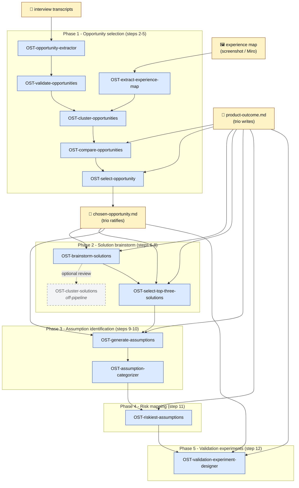

## Namnkonvention

Hela samlingen heter **Opportunity Solution Tree Agents** (OST Agents). Varje skill prefixas `OST-<verb-noun>` i `.claude/skills/`. Tidigare namn var "Workshop 3 AI-assister"; arkiverat 2026-05-13 till förmån för OST-namnet eftersom det är vad det faktiskt är - automatisering av Teresa Torres' Opportunity Solution Tree-process.

## Pipeline-översikt



## Vad det här dokumentet är

Det här är **inte** guiden för trio. Guiden är `plans/workshop-3-guide-trio-process.md`. Det är **inte** heller en spec på de skills och agenter vi ska bygga.

Det är **designdokumentet för Opportunity Solution Tree Agents** där vi diskuterar:

- Vilken Claude Code-mekanism varje assist mappar till (skill, agent, hybrid)
- Vilka tools assisten behöver
- Vad som är beroenden mellan assister
- Vilken ordning vi bygger dem i
- Var de öppna designfrågorna sitter

Varje sektion är skriven för att brainstormläsaren ska kunna ta upp **en assist åt gången** och designa den utan att behöva läsa hela guiden parallellt.

## Cross-cutting designfrågor

Frågor som inte hör hemma per assist utan gäller alla, eller flera:

### Skill kontra agent i Claude Code

Claude Code har två primära mekanismer:

- **Skill:** en markdown-fil med frontmatter, anropas via Skill-verktyget. Tar input, kör en prompt-strategi, returnerar output. Bra för deterministiska transformationer.
- **Agent:** flera tool-calls i sekvens, ofta med iterativ logik. Bra när uppgiften kräver att läsa flera filer, anropa MCP, jämföra många kandidater, eller fatta delbeslut längs vägen.

För varje assist nedan föreslås en initial mappning. Den ska utmanas i brainstorm.

### Claude Managed Agents som plattformsalternativ

Sedan brainstorm-inputen skrevs har Anthropic lanserat tre nya primitiv i Claude Managed Agents (blogg 2026-05-06) som påverkar var och hur flera av assisterna här lämpligast byggs:

- **Multiagent orchestration:** En lead agent kan delegera till specialister med egna model, prompt och tools. Specialisterna jobbar parallellt på ett delat filsystem och bidrar tillbaka till lead agentens kontext. Eventpersistens och full tracing i Claude Console.
- **Outcomes:** Utvecklaren skriver en rubric som beskriver framgång; en grader i separat kontextfönster utvärderar och returnerar agent för en till pass om kvaliteten inte räcker.
- **Dreaming:** Schemalagd process som extraherar mönster från sessioner och kuraterar minnen så agenter förbättras över tid.

Mappning mot assisterna i den här inputen:

| Assist                                  | Hur Managed Agents-primitiv kan användas                                                                                                                                                                       |
| --------------------------------------- | -------------------------------------------------------------------------------------------------------------------------------------------------------------------------------------------------------------- |
| 6 (Synthetic trio brainstormer)         | Multiagent orchestration matchar designen rakt av: tre rolldiversifierade specialister (PM, UX, Tech Lead) som lead-agent orchestrar parallellt per omgång. Outcomes-rubric kan koda anti-duplikation och rolltäckning som kvalitetskriterium. |
| 9 (Assumption generator)                | Multiagent orchestration: tre metod-specialister (storymap, pre-mortem, outcome-impact) per lösning. Outcomes-rubric kan koda täckning över de tre metoderna plus dedupering.                                  |
| 8 (Top-3 solution selector)             | Outcomes-rubric kan koda "rationale traces back to product outcome" och "tre lösningar är diversifierade över kluster".                                                                                        |
| 11 (Riskiest-assumptions agent)         | Outcomes-rubric kan koda binär scoring med konkret rationale per antagande.                                                                                                                                    |
| 12 (Validation-experiment-designer)     | Outcomes-rubric kan koda cheapest-viable och falsifierbar success_criteria som kvalitetskrav.                                                                                                                  |

Dreaming är out of scope för en enskild workshopkörning men relevant om assisterna körs över flera trios och kvartal: mönster som "trios glömmer ofta att markera evidensgap" kan surfaca över tid.

**Beslut (2026-05-08): Claude Code valt.** Operatörsbasen är två scilla-personer (Joni, Linda) snarare än en hel organisation, och metodiken körs när som helst snarare än som workshop-tool. Managed Agents distributionsfördelar väger då inte upp den operativa overheaden (auth, frontend, access management). Iterationshastigheten väger också tungt eftersom prompts och datakontrakt kommer ändras löpande över nästa kvartal.

Det vi avstår från är orchestration-primitiven inbyggt. Multi-agent för assist 6 och 9 kodas via Task-tool plus prompt-engineering, och outcomes-rubric för assist 8, 11 och 12 lever antingen i prompten eller som en separat granskning-skill snarare än som strukturell grader-passage. Mappningstabellen ovan behålls som referens om någon assist senare flyttas till Managed Agents.

### Var bor assisterna i repot?

Öppen fråga. Möjliga konventioner:

- `.claude/skills/` för CC-skills (om det är konventionen i den setup trio får)
- `.claude/agents/` eller motsvarande för agenter
- Knowledge-anchors fortsätter ligga i `knowledge/` och refereras från skill-prompten

Detta behöver låsas innan vi börjar bygga.

### Datakontrakt

Beslut låst 2026-05-09.

**Format-regeln**

JSON är kanonisk inter-skill-form, medan markdown är dess rendering för mänsklig läsning. Båda skrivs av varje assist som producerar strukturerad data konsumerad downstream OCH läst av människor (kategori A nedan). Markdown:en genereras deterministiskt från JSON via en renderingsmall i skill-prompten, så formaten kan inte divergera. Downstream-assister läser bara JSON-formen.

Tre kategorier:

- **A. Paired output (JSON + markdown):** assist 2, 3b, 4, 5, 6, 7, 8, 9, 10, 11, 12.
- **B. Markdown enbart:** assist 3a-validator (granskningsförslag till trio utan downstream-konsumtion).
- **C. Specialfall:** steg 1 (trio skriver `product-outcome.md` själv) och inputs som experience map-skärmdumpar. Assist 3a-extractor är gränsfall som tas vid designen av den specifika assisten.

Avvikelse från tidigare spec: assist 11 hade specats med JSON enbart; lägger till markdown-rendering så trio kan läsa och godkänna riskbedömningarna.

**Filnamnskonvention**

`workspace/<fas>/<artifact-typ>-<YYYY-MM-DD>.<ext>` där `<ext>` är `.json` eller `.md`. Paired output skriver båda filerna med samma rotnamn. Re-runs samma dag skriver över befintlig fil; commit:a först om tidigare version ska bevaras.

Artifact-typ är kebab-case och börjar med substantiv (`opportunities-extracted` snarare än `extract-opportunities`). Specifika namn låses per assist.

**Mapp-struktur**

```text
workspace/
├── context/                  # Trio-skrivna inputs (read-only för skills)
├── 1-opportunity-val/        # Assist 1-3: extract-opportunities, OST-extract-experience-map, OST-validate-opportunities
├── 2-opportunity-compare/    # Assist 4: OST-compare-opportunities
├── 3-opportunity-select/     # Assist 5: OST-select-opportunity
├── 4-solution-brainstorm/    # Assist 6: OST-brainstorm-solutions
└── 5-solution-cluster/       # Assist 7: OST-cluster-solutions (nästa att bygga)
```

Konventionen är **en mapp per AI-assist**, numrerad i invocation-ordning. Undantag: `1-opportunity-val/` klumpar assist 1-3 (extract + experience-map + validate) historiskt - kvarstår tills någon har anledning att splitta. Folder-namn matchar skill-namn (utan verb-prefix där det blir naturligt).

Mappstrukturen för assist 8-12 låses när respektive assist designas, inte i förväg - speculativa folder-namn för obyggda assister leder till samma drift som detta TODO försökte stänga.

Phased subdirs för att (a) hålla flat workspace navigerbart med tolv assister gånger paired output gånger flera körningar, (b) göra dependency-impact synligt vid re-runs, (c) ge stabila paths som skills kan referera till utan att veta varifrån de blir invokerade.

`context/` rymmer trio-skrivna inputs. Inputs som transkript och experience map-skärmdumpar lever i sina existerande hem (`teams/<team>/`, `docs/`) och passas in som parametrar till assister utan att kopieras till workspace/.

Per-klient-isolering kommer för fritt eftersom workspace/ ligger i klient-repo:t. Inga client-name-prefix behövs i filnamn.

**Schema-hantering**

JSON-schemas lever som inbäddade exempel i `knowledge/discovery/<topic>.md` med fält-beskrivningar, snarare än som formell JSON Schema med `$schema`. Befintligt mönster (`experience-mapping.md`, `assumption-risk-mapping.md`, `assumption-validation.md`) behålls och utvidgas. Varje knowledge-doc kombinerar konceptuell förklaring, schema-exempel och eventuell renderingsmall.

Versionering: semver-lite. `v0.1 → v0.2` för bakåtkompatibla tillägg, `v1.0` vid första stabila release, `v2.0` för breaking changes. Versionen står överst i schema-sektionen och bump:as manuellt vid commit.

Validering: assister producerar JSON enligt schemat i sin knowledge anchor; downstream-assister antar att schemat håller. Vid malformed input exit:ar skill med tydligt felmeddelande snarare än degraderar tyst.

Schemas saknas idag för assist 3b, 4, 5, 6, 7, 8, 9 och 10. Skapas per assist när vi designar respektive assist, för att undvika spekulativa schemas som visar sig fel när assisten faktiskt byggs.

**Knowledge-folder-distribution**

Skills läser knowledge anchors vid körtid (runtime-access) snarare än som inbyggt i skill-prompten. Knowledge/ följer med skills oavsett var de bor. Idag i Metria-repots rot; framtida scilla-delat hem antas ha samma struktur. Klient-specifika overrides via lokal knowledge/ i klient-repo:t är möjligt men sällsynt och tas vid behov.

### Operatörens invocation-yta

Beslut låst 2026-05-09: hybrid. NL primär, slash-commands som genvägar.

**Hur det fungerar:**

- Operatören (Joni eller Linda) säger något som matchar en skills description, och CC auto-triggar via description-match. Detta är default.
- Slash-commands (`/<skill-name>`) finns som explicita genvägar för det som körs ofta eller där NL ger ambiguitet med andra skills.

**Konsekvenser för skill-mallen:**

- Description-fältet är load-bearing och måste tydligt skilja skills i samma domän. Mönster: "for X, when Y, output Z" på engelska.
- Slash-command-namn följer skillens kebab-case (skill `extract-opportunities` blir `/extract-opportunities`).
- Inget krav på att alla skills får en slash-command; läggs till opportunistiskt.

Notera: ursprungliga formuleringen nämnde "trio" som invocation-aktör. Operatörsmodellen är reviderad i platform-beslutet ovan: skills körs av scilla-operatörer (Joni, Linda), och trio läser markdown-output och approves vid HITL-checkpoints.

### HITL-mönster per fas

Det är två olika human-in-the-loop-mönster i den här processen:

- **Steg 1:** Trio-only. Trio skriver sitt product outcome i `workspace/context/product-outcome.md` med eventuella kända begränsningar. Ingen AI-assist.
- **Steg 2-5 (välja opportunity):** Parallell HITL. AI och trio gör samma jobb. Trio jämför AI:ns output mot sin egen vid en explicit jämförelsepunkt per steg.
- **Steg 6-8 (solution brainstorm):** AI-driven HITL. AI producerar lösningskandidater, klustrar dem och väljer top 3. Trio kommer in vid slutet och approves de tre utvalda. Det är inte en parallell process där människan brainstormar samtidigt.
- **Steg 9-10 (assumption identification):** AI-driven HITL, samma princip som fas 2. AI genererar antaganden per lösning via tre metoder och kategoriserar dem. Trio läser och godkänner.
- **Steg 11 (assumption risk mapping):** AI-driven HITL. Agent klassificerar varje antagande på två binära axlar (importance, evidence) och flaggar de mest riskfyllda. Output i JSON. Trio läser och godkänner.
- **Steg 12 (assumption validation experiments):** AI-driven HITL. Agent designar en Test Card per riskfyllt antagande, baserat på Blands metod, och optimerar för cheapest viable test. Output i JSON plus markdown Test Cards. Trio läser, godkänner och kör.

Det betyder att assister i steg 6-12 designas för att producera trovärdig output utan parallell mänsklig kalibrering. Kvaliteten kommer från AI-loopens egen logik (rolldiversifiering i fas 2, multi-method-täckning i fas 3, binär scoring med rationale i fas 4, cheapest-viable-heuristic i fas 5) snarare än från jämförelse mot trio.

**Pedagogisk spänning som inte är upplöst:** Skärmdumpens nota säger att antaganden är ett område där trio ska träna upp egen förmåga att se sina antaganden, och att AI är ett träningsstöd. Den nuvarande designen är AI-driven, vilket optimerar för output-hastighet snarare än trio-kapabilitetsbygge. Ifrågasätt detta i brainstormpasset om det ska designas om till parallell HITL eller hybrid där trio gör en metod själv och AI gör de andra två.

## Beroendegraf

```text
    (workspace/context/product-outcome.md, skrivet av trio)
              │
              ├─────────────────────┐
              │                     │
[Format-validator]    [Opportunity-extractor]    [Experience map importer]
              │                     │                       │
              └────────┬────────────┘                       │
                       ▼                                    │
            (rena opportunities)                            │
                       │                                    │
                       └────────────┬───────────────────────┘
                                    ▼
                       [Opportunity-clusterer]
                                    │
                                    ▼
                    (klustrad opportunity-fil)
                                    │
                                    ▼
                          [Comparator + evidensgap]
                                    │
                                    ▼
                         (jämförelsematris + gap-lista)
                                    │
                                    ▼
                            [Opportunity-väljare]
                                    │
                                    ▼
                       (vald opportunity + rationale)
                                    │
                                    ▼
                  [Synthetic trio brainstormer]  ← (product outcome)
                                    │
                                    ▼
                       (18 lösningskandidater)
                                    │
                                    ▼
                          [Solution clusterer]
                                    │
                                    ▼
                       (klustrad lösningskarta)
                                    │
                                    ▼
                            [Top-3 selector]
                                    │
                                    ▼
                       (top 3 lösningar med rationale)
                                    │
                                    ▼
                  [Assumption generator]  ← (product outcome, opportunity)
                                    │
                                    ▼
                  (deduperad antagande-lista per lösning)
                                    │
                                    ▼
                       [Assumption categorizer]
                                    │
                                    ▼
              (kategoriserade antaganden per lösning, fem kategorier)
                                    │
                                    ▼
                 [Riskiest-assumptions agent]
                                    │
                                    ▼
              (JSON: antaganden med importance, evidence, is_riskiest)
                                    │
                                    ▼
              [Validation-experiment-designer agent]
                                    │
                                    ▼
        (JSON + markdown Test Cards: rekommenderad test per riskfyllt antagande)
```

## Föreslagen bygg-ordning

Sortering efter beroenden och förväntad svårighetsgrad. Steg 1 (trio skriver outcome i `workspace/context/product-outcome.md`) är inte en AI-assist och ingår inte i listan.

1. **Format-validator** - oberoende, hjälper trio städa befintliga artefakter
2. **Opportunity-extractor** - oberoende, men kräver att transkriptkonventionen är låst
3. **Experience map importer** - gatekeeper för downstream, tekniskt mer komplex (vision eller MCP)
4. **Opportunity-clusterer** - kräver att format-validator/extractor och experience-map-importer finns
5. **Comparator + evidensgap** - kräver klustrad fil + outcome
6. **Opportunity-väljare** - terminal i fas 1, enklast logik men kräver matrisen från comparator
7. **Synthetic trio solution brainstormer** - startar fas 2, tekniskt mest komplex (multi-agent orchestration, anti-duplication mellan rundor)
8. **Solution clusterer** - beroende av brainstormer
9. **Top-3 solution selector** - terminal i fas 2
10. **Assumption generator** - startar fas 3, multi-method orchestration per lösning
11. **Assumption categorizer** - terminal i fas 3
12. **Riskiest-assumptions agent** - fas 4, binär scoring med rationale
13. **Validation-experiment-designer agent** - fas 5, Test Card-generering med cheapest-viable-heuristic

End-to-end-tråd kan testas tidigt med syntetisk data om vi bygger comparator + väljare mot mock-input innan opportunity-utvinningen är klar. Senare faser kan på samma sätt testas mot mock-input för respektive uppströms artefakt innan tidigare faser är kompletta.

---

## Per assist

### Steg 1: Trio skriver outcome (ingen AI-assist)

Trio skriver sitt product outcome i `workspace/context/product-outcome.md` med eventuella kända begränsningar (saknad baseline, osatt tidsram osv). Trio accepterar att outcomet kan ha luckor om de är medvetna och dokumenterade. Outcomet är input till downstream-skills, inte output från en AI-assist.

Anchors: `../knowledge/discovery/product-outcomes-i-olika-skeden.md` och `../knowledge/discovery/product-outcomes-vs-business-outcomes.md` finns för trio att konsultera vid skrivning, men det är trios ansvar, inte en AI-uppgift.

---

### 2. Experience map importer och validator

**Jobb (en mening):** Läs trios experience map och producera JSON enligt `../knowledge/discovery/experience-mapping.md`-schemat plus en mänskligt läsbar markdown-rendering, och flagga journey-steg som saknar transkriptstöd.

**Input:**

- Experience map som skärmdump eller Miro-resurs via MCP
- Intervjutranskript

**Output:**

- JSON enligt `experience-mapping.md` schema v0.1, sparad till bestämd plats
- Markdown-rendering av samma extraktion
- Lista över journey-steg som inte har stöd i transkripten

**Föreslagen typ:** Agent. Den behöver läsa visuellt material (vision), möjligen anropa MCP, sedan korsreferera mot transkript.

**Tools behövda:** Read (vision), möjligen Miro MCP, Read (transkript), Write (output-filer).

**Uppströms-beroenden:** Trio har skapat experience map.

**Nedströms-konsumenter:** Steg 3b (clusterer) använder JSON. Steg 4 och 5 indirekt.

**Knowledge-anchors:** `../knowledge/discovery/experience-mapping.md`.

**Öppna designfrågor:**

- Vilken Miro MCP är det vi tänker oss, om någon? Eller är skärmdump primärvägen i v1?
- Hur strikt schema-validering? Hård validering med fel om JSON inte håller, eller lös med varningar?
- Vilka filplatser är output-konventioner?
- Logik-utvärdering av journey som extra output, ja eller nej? (Joni parkerade frågan tidigare. Tas upp här.)

**Prio:** Medium-hög. Gatekeeper för downstream men tekniskt mest osäker. Kan parallelliseras med 1 och 3.

---

### 3a. Opportunity format-validator

**Jobb (en mening):** Granska varje opportunity mot reglerna i `../knowledge/discovery/opportunity-citation-format.md` och flagga den som godkänd, behöver tweak, eller solution in disguise.

**Input:** Lista av opportunities i citatformat (text + källa + ev. tweaks).

**Output:** Markdown-tabell med per-opportunity-bedömning. Bara flagga (verdict + motivering), ingen omformulering. Kategori B (markdown enbart, ingen JSON eftersom output inte konsumeras downstream).

**Föreslagen typ:** Skill. Pure transformation över en avgränsad input.

**Tools behövda:** Read (för knowledge anchors).

**Uppströms-beroenden:** Trio har en lista, eller `extract-opportunities` har körts.

**Nedströms-konsumenter:** Trio själv. Renade opportunities går vidare till 3b.

**Knowledge-anchors:** `../knowledge/discovery/opportunity-citation-format.md`, `../knowledge/discovery/opportunity-solution-tree-teresa-torres.md`.

**Öppna designfrågor (låsta 2026-05-09):**

- Format för input. Plain markdown, JSON, en specifik fil-konvention?  
  svar: Plain markdown enligt `../knowledge/discovery/opportunity-citation-format.md`. En fil per körning. Default-filsökväg `workspace/1-opportunity-val/opportunities-extracted-<date>.md`; operatören kan ange annan.
- Ska assisten kunna föreslå konkreta omformuleringar, eller bara flagga?  
  svar: Bara flagga. Trios egen formulering är canonical text. Lärupplevelsen är starkare när trio själv hittar formuleringen utifrån motiveringen.

**Skill-namn (låst):** `OST-validate-opportunities`. Description-fältet generaliserat utöver Metria-kontext: skill används av product trios och researchers generellt.

**Prio:** Hög. Oberoende, snabb att bygga.

---

### 3a (parallell). Opportunity-extractor

**Jobb (en mening):** Läs intervjutranskript och extrahera kandidat-opportunities i citat-stickie-format.

**Input:** Ett eller flera intervjutranskript (markerade talare).

**Output:** Lista av kandidat-opportunities i workshop-2-citatformat. Inte godkända per default, kandidater för trio att granska.

**Föreslagen typ:** Skill om transkripten är hanterbara i ett pass, agent om vi behöver iterera över många.

**Tools behövda:** Read.

**Uppströms-beroenden:** Transkript finns.

**Nedströms-konsumenter:** Format-validator (3a) eller direkt trio.

**Knowledge-anchors:** `../knowledge/discovery/opportunity-citation-format.md`.

**Öppna designfrågor:**

- Hur skiljer assisten signal (riktig opportunity) från brus (artigt prat, sidospår)?
- Hur många kandidater per transkript, och vill vi ha ett tak?
- Ska den länka tillbaka till exakt tidsstämpel om transkriptet har det?

**Prio:** Medium. Behövs när opportunities saknas eller är tunna, kan annars hoppa över.

---

### 3b. Opportunity-clusterer

**Jobb (en mening):** Tag varje validerad opportunity mot ett journey-steg i experience map och producera en strukturerad fil.

**Input:** Validerade opportunities (från 3a) + experience map JSON (från 2).

**Output:** Strukturerad fil (förslagsvis JSON) där varje opportunity är taggad med phase_id och eventuellt step_id, plus föräldra-barn-grupperingar enligt OST.

**Föreslagen typ:** Skill. Kombinerar två inputs och producerar en utvidgning.

**Tools behövda:** Read.

**Uppströms-beroenden:** 3a och 2.

**Nedströms-konsumenter:** Steg 4 (comparator).

**Knowledge-anchors:** `../knowledge/discovery/opportunity-solution-tree-teresa-torres.md`, sektion "Opportunity space".

**Öppna designfrågor:**

- Föräldra-barn-grupperingar: hur djupa? OST tillåter att opportunities har sub-opportunities.   
svar: Vi börjar med max 2 nivåer parent-child opportunities
- Vad gör assisten om en opportunity inte passar i någon phase? Skapa "okänd"-bucket eller flagga för trio?  
svar: opportunities kan hamna utanför en phase, behöver bara en tydlig klassificering 

**Prio:** Medium. Beroende av att 2 och 3a finns.

---

### 4. Opportunity-comparator med evidensgap-analys

**Jobb (en mening):** Jämför opportunities parvis mot product outcome och Torres-kriterier, bygg argumentmatris, och lista var evidensen är tunn.

**Input:** Klustrad opportunities-fil (från 3b) + product outcome.

**Output:**

- Jämförelsematris (Torres-kriterier som rader, opportunities som kolumner, eller vice versa)
- Lista evidensgap: vilka kriterier per opportunity som inte kan bedömas på nuvarande dataunderlag

**Föreslagen typ:** Agent. Multi-step resonemang, parvis jämförelse, kräver att hålla kontext över flera kandidater och kriterier.

**Tools behövda:** Read.

**Uppströms-beroenden:** Steg 3b (Opportunity-clusterer), `workspace/context/product-outcome.md`.

**Nedströms-konsumenter:** Steg 5.

**Knowledge-anchors:** `../knowledge/discovery/opportunity-solution-tree-teresa-torres.md`, Torres "Continuous Discovery Habits" kapitel 7.

**Öppna designfrågor:**

- Hur strukturerad blir matrisen? Färdig prio-poäng eller bara argument-text per cell?
- Hur tydligt ska assisten markera när den **gissar** kontra när den har stöd i transkripten?
- Effort/feasibility ska **inte** vägas in (per Torres-principen). Hur säkerställer vi det i prompten?

**Prio:** Medium-hög. Kärnkomponenten i hela processen, men beroende av flera tidigare.

---

### 5. Opportunity-väljare

**Jobb (en mening):** Föreslå en vald opportunity baserat på jämförelsematrisen, plus rationale, utan att väga in effort.

**Input:** Jämförelsematris + evidensgap-lista (från 4) + product outcome (från 1).

**Output:** En vald opportunity, motivering, vilka andra övervägdes och varför inte, vilka evidensgap som följer med in i nästa fas.

**Föreslagen typ:** Skill. Sammanfattning och beslutsförslag på basis av en strukturerad input.

**Tools behövda:** Read.

**Uppströms-beroenden:** Steg 4 (Comparator), `workspace/context/product-outcome.md`.

**Nedströms-konsumenter:** Trio själv. Output är slutartefakten.

**Knowledge-anchors:** `../knowledge/discovery/opportunity-solution-tree-teresa-torres.md`, principen "Don't assess effort during opportunity selection".

**Öppna designfrågor:**

- Slutleveransens format till nästa workshop, fri text plus rationale eller strukturerad mall? (Öppen fråga från guiden, väntar på beslut.)
- Hur uttalad ska assisten vara om sin egen osäkerhet? "Jag rekommenderar X givet vad jag ser, men ..." vs ren rekommendation?
- Hur hanterar assisten oavgjort, två opportunities som ser likvärdiga ut?

**Prio:** Medium. Bygg sist, men enkel logik.

---

---

## Fas 2: Solution brainstorm (steg 6-8)

Efter att trio har en vald opportunity tar AI över och producerar lösningskandidater. Trio kommer in vid slutet och approves top 3. Se HITL-mönstret per fas i cross-cutting-sektionen.

Designfilosofin är inspirerad av workshop-loops som tvingar deltagare bortom de mest uppenbara idéerna. Round 1 fångar det intuitiva (vilket LLM:er, precis som människor, gravitar till). Round 2 och 3 förbjuder duplikat och kräver nya eller bygg-på-idéer. Tre omgångar ger tillräcklig divergens.

---

### 6. Synthetic trio solution brainstormer

**Jobb (en mening):** Generera 18 lösningskandidater i tre omgångar genom tre rolldiversifierade sub-agenter (PM, UX, Tech Lead) som var och en producerar två idéer per omgång.

**Input:**

- Vald opportunity plus rationale (från assist 5)
- Product outcome (från assist 1)
- Rollbeskrivningar som anchor

**Output:** 18 lösningar i strukturerat format. Varje lösning har titel, beskrivning, generating role och round-nummer.

**Föreslagen typ:** Agent. Kräver multi-agent orchestration (tre sub-agenter parallellt per omgång) och multi-round looping med anti-duplication-logik.

**Tools behövda:** Read (för rollbeskrivningar och input), Agent (för sub-agent-spawning om det är så vi orkestrerar).

**Uppströms-beroenden:** Steg 5 (Opportunity-väljare), `workspace/context/product-outcome.md`.

**Nedströms-konsumenter:** Steg 7 (Solution clusterer).

**Knowledge-anchors:**

- `docs/underlag-fran-metria/documents/roll-product-manager.md`
- `docs/underlag-fran-metria/documents/roll-ux-designer.md`
- `docs/underlag-fran-metria/documents/roll-tech-lead.md`
- `../knowledge/foundations/tech-product-trio-responsibility-split.md`
- `../knowledge/foundations/product-trio-operational-practices.md`
- `../knowledge/discovery/opportunity-solution-tree-teresa-torres.md` (solution space-principerna)

**Öppna designfrågor:**

- Orkestreringsmönster: en agent som spawnar tre sub-agenter parallellt per omgång, eller en agent som sekventiellt kör roll-prompts internt? Påverkar latens och prompt-kontroll.
- Round 2 och 3-promptarna måste explicit förbjuda duplicering med tidigare omgångars idéer. Hur hindrar vi LLM:en från att ändå gravitera tillbaka till samma kärna med nya ord?
- Definitionen av "lösning": något som adresserar och kan påverka product outcome. Allt annat är öppet. Ska prompten begränsa till user-facing, eller tillåta process- och policy-orienterade lösningar?
- Outputformat per lösning: bara titel och beskrivning, eller även mappade antaganden, riskbedömning, eller annan metadata?
- Ska role-attribution synas i outputen, eller är det bara internt för diversifiering?

**Prio:** Hög. Startar fas 2 och tekniskt mest komplex.

---

### 7. Solution clusterer

> **Status 2026-05-11:** Byggt och fungerande, men **off-pipeline** efter v2-redesignen av assist 8. Assist 8 v2 läser OST-brainstorm-solutions output direkt utan clustering-mellansteg. Skillet stannar tillgängligt som fristående tooling för trios som vill ha clustered review av brainstormen out-of-band. Tas inte bort; deprekerings-beslut parkerat i `TODO.md`.

**Jobb (en mening):** Gruppera de 18 lösningskandidaterna efter likhet och tema så att duplikat försvinner och unika idéer framträder.

**Input:** 18 lösningar från assist 8.

**Output:** Klustrad lösningskarta. Varje kluster har titel, kort summa, och listar de individuella lösningarna inom det.

**Föreslagen typ:** Skill. Semantisk klustring i ett pass.

**Tools behövda:** Read.

**Uppströms-beroenden:** Steg 6 (Synthetic trio brainstormer).

**Nedströms-konsumenter:** Steg 8 (Top-3 selector).

**Knowledge-anchors:** Inga specifika.

**Öppna designfrågor:**

- Antal kluster: auto-bestämt eller målgruppat (typ 5-10)?
- Cluster-summary-format: en sammanfattning per kluster eller listas alla individuella lösningar inom?
- Hanteras bygg-på-relationer mellan idéer? Om en round 2-lösning byggde på en round 1-lösning, syns den relationen i kartan?
- Vad gör clusterern med en outlier-lösning som inte passar i något kluster? Egen bucket eller tvinga in i närmaste?

**Prio:** Medium. Beroende av 8.

---

### 8. Top-3 solution selector

> **Status 2026-05-11:** v2 byggt. v0.1 (cluster-input, discriminator picks, alternatives-section) byggt och redesignat samma dag efter smoke-test surfacade arkitekturproblem. Se `skills-design/OST-select-top-three-solutions-design.md` för v2-spec; v0.1-design i git-historiken vid commit `36a2826`.

**Jobb (en mening):** Välj exakt 3 specifika lösningar från de 18 brainstormade, rankade by descending outcome-impact probability, var och en med 2-3 meningar outcome-mapping rationale.

**Input:**

- Solution-candidates JSON (från steg 6, OST-brainstorm-solutions) - de 18 specifika lösningarna
- `workspace/context/chosen-opportunity.md` (trio-ratificerad)
- `workspace/context/product-outcome.md`

**Output:** Top 3 specifika lösningar (inga clusters, ingen discriminator). Per lösning: id, title, generating_role, round_number, description (verbatim från source), plus 2-3 meningar outcome-mapping rationale. Ingen alternatives-sektion (trio läser brainstormer-markdown om de vill överrida). Schema v0.2 i `../knowledge/discovery/top-three-selection.md`.

**Föreslagen typ:** Skill, single-pass.

**Tools behövda:** Read.

**Uppströms-beroenden:** Steg 6 (OST-brainstorm-solutions), `workspace/context/chosen-opportunity.md`, `workspace/context/product-outcome.md`. **Inte** steg 7 (clusterer) - v2 hoppar över clustering-steget.

**Nedströms-konsumenter:** Trio (granskar, ratificerar via `workspace/context/ratifications.md`), steg 9 (Assumption generator) som läser ratifications.md för att hitta godkänd version.

**Knowledge-anchors:** `../knowledge/discovery/top-three-selection.md` (schema v0.2, fyra v2 låsta beslut), `../knowledge/discovery/solution-brainstorm.md` (source schema), `../knowledge/discovery/opportunity-solution-tree-teresa-torres.md` (Torres-principer).

**Låsta beslut (v2):**

- Strict 3 picks (Torres canon).
- Always specifik member-pick (ingen discriminator, ingen cluster-pick).
- Rationale: outcome-mapping only, 2-3 meningar (ingen customer-evidence anchor, ingen cluster-context, ingen assumption-reasoning).
- Ingen alternatives_considered-sektion.

**Prio:** Medium. Terminal i fas 2.

---

---

## Fas 3: Assumption identification (steg 9-10)

Efter att top 3-lösningarna är valda i fas 2 ska antaganden som måste hålla för varje lösning surfacas. Trio kommer in i slutet och godkänner outputen. Se HITL-mönstret per fas i cross-cutting-sektionen, inklusive den olösta pedagogiska spänningen.

**Designfilosofi:** Tre metoder, samma som workshopens analoga övning - storymap av lösningen, pre-mortem och outcome-impact-resonemang. Varje metod kör som en separat prompt-pass per lösning. Skälet är att varje metod attackerar en specifik LLM-svaghet:

- **Storymap** tvingar decomposition per användarsteg, hindrar generic high-level-antaganden
- **Pre-mortem** flippar framen från "ska funka" till "har misslyckats", neutraliserar plausibility-bias
- **Outcome-impact-resonemang** tvingar explicit causal chain, exponerar antaganden i logikkedjan

Tre oberoende frames ger bredare täckning än en. Rolldiversifiering (PM, UX, Tech Lead) som i fas 2 används **inte** här. Metoden är den naturliga diversifieringen, inte rollen, och kategorierna i sig partitionerar redan rollens perspektiv.

---

### 9. Assumption generator

**Jobb (en mening):** Generera alla antaganden som måste vara sanna för att top 3-lösningarna ska fungera, genom tre parallella metoder per lösning (storymap, pre-mortem, outcome-impact).

**Input:**

- Top 3 lösningar plus rationale (från assist 10)
- Product outcome (från assist 1)
- Vald opportunity plus rationale (från assist 7)

**Output:** Per lösning, en deduperad lista antaganden, varje med attribution till källmetod (för spårbarhet).

**Föreslagen typ:** Skill som spawnar 9 sub-agents parallellt via Agent-tool (3 metoder × 3 lösningar), plus 3 per-solution LLM dedup-passes med source_methods som array. Locked 2026-05-11.

**Tools behövda:** Read.

**Uppströms-beroenden:** Steg 8 (Top-3 selector), `workspace/context/product-outcome.md`, steg 5 (Opportunity-väljare).

**Nedströms-konsumenter:** Steg 10 (Assumption categorizer).

**Knowledge-anchors:**

- `../knowledge/discovery/assumption-types.md` (taxonomin för senare kategorisering)
- `../knowledge/discovery/opportunity-solution-tree-teresa-torres.md` (decompose-into-assumptions-fasen)
- Skärmdumpsreferens: `plans/Session 3_ Opportunities, Solutions & Assumptions - Identifiera antaganden 60 min.jpg` för metodbeskrivningarna

**Locked design:** See `skills-design/OST-generate-assumptions-design.md` (committed 2026-05-11). The six open questions above are resolved as:

- Methods orchestrated parallellt (9 sub-agents blint mot varandra via Agent tool, 3 metoder × 3 lösningar).
- Semantisk dedup: en LLM-pass per lösning som mergar similar assumptions across methods; `source_methods` bevaras som array (1-3 entries, triangulerings-signal).
- Källmetod synlig i JSON som `source_methods`-array, renderas som inline-tagg i markdown (`[SM]`, `[PrM]`, `[OI]`, multi-source `[OI+PrM+SM]` osv).
- Tak per metod-pass: fast 6 per sub-agent (6 × 3 × 3 = 54 raw, ~30-42 efter dedup).
- Cross-solution assumptions: ingen markering, per-solution-listor är oberoende.
- Experience map ges som anchoring context endast till storymap-sub-agents, med explicit "future flow, not today"-instruktion.

**Prio:** Hög. Kärna i fas 3.

---

### 10. Assumption categorizer

**Jobb (en mening):** Klassificera varje antagande in i en av fem kategorier (desirability, usability, feasibility, viability, other) enligt taxonomin i `../knowledge/discovery/assumption-types.md`.

**Input:** Deduperad antagande-lista per lösning från assist 9 (`OST-generate-assumptions`).

**Output:** Per lösning, antaganden grupperade under fem kategori-rubriker. Markdown och eventuellt JSON. Varje antagande ligger i exakt en kategori.

**Föreslagen typ:** Skill. Per-antagande klassificering mot en låst taxonomi.

**Tools behövda:** Read.

**Uppströms-beroenden:** Steg 9 (Assumption generator).

**Nedströms-konsumenter:** Steg 11 (Riskiest-assumptions agent) som läser kategoriserade antaganden från `workspace/8-assumptions-categorized/`.

**Knowledge-anchors:** `../knowledge/discovery/assumption-types.md` (taxonomin med definitioner och exempel), `../knowledge/foundations/product-operating-model-marty-cagan.md` (Cagan five product risks som ankrar taxonomin).

**Locked design:** See `skills-design/OST-assumption-categorizer-design.md` (committed 2026-05-12). The four open questions above are resolved as:

- Single category per antagande, risk-falls tiebreaker. Inget `rationale`-fält i schemat; trio kan editera JSON vid review om de vill överrida.
- 'Other' reserverat för genuint-icke-Cagan antaganden (legal, ethical, regulatory, market-timing, organizational). Default-fallback för osäkerhet är att forcera en av de fyra Cagan-kategorierna.
- Output-format: flat per-antagande-rader med `[category]`-tagg efter `[methods]`-taggen. Inga per-kategori-rubriker; row-order bevarar upstream-ordning (identity-mapping).
- Intra-kategori-ordning: ingen; identity-mapping över upstream `assumptions[]` är invariant. Re-sortering är v0.2-followup (#8 "Category-grouped rendering option").

**Prio:** Hög. Beroende av 11. Sista i fas 3.

---

---

## Fas 4: Assumption risk mapping (steg 11)

Efter att antagandena är genererade och kategoriserade i fas 3 ska de mest riskfyllda identifieras. Trio kan inte testa alla. De ska testa de som är mest avgörande och har minst evidens, det Eric Ries kallade "leap of faith assumptions" och som David Bland operationaliserar i en 2x2-matris.

**Designfilosofi:** Två binära frågor per antagande, samma som workshopens analoga övning. Binärt med flit. Graderad scoring inbjuder till falsk precision och kaninhål. JSON-output så downstream-konsumenter (assumption testing-fas, framtida risk-dashboards, trios review) får en strukturerad artefakt.

---

### 11. Riskiest-assumptions agent

**Jobb (en mening):** För varje antagande per lösning, klassificera på två binära axlar (importance, evidence) och flagga det som mest riskfyllt om det är högt på importance och svagt på evidence.

**Input:** Kategoriserade antaganden per lösning (från assist 12), product outcome (från assist 1), top 3-lösningar med rationale (från assist 10).

**Output:** JSON enligt schemat i `../knowledge/discovery/assumption-risk-mapping.md`. Per antagande: text, kategori, importance, evidence, is_riskiest, rationale.

**Föreslagen typ:** Skill, single-pass scoring against låst 2x2-ramverk. Workshop-3-serien har konvergerat på skill-mönstret (även för multi-agent-orchestration som OST-generate-assumptions); en agent-paketering hade duplicerat operativ overhead utan att förbättra kapabilitet. Locked 2026-05-12.

**Tools behövda:** Read, Write.

**Uppströms-beroenden:** Steg 10 (Assumption categorizer), `workspace/context/product-outcome.md` (för product outcome som referens i importance-bedömning), steg 8 (Top-3 selector, för lösningskontext).

**Nedströms-konsumenter:** Trio (för läsning och godkännande), framtida assumption testing-fas (utanför nuvarande scope).

**Knowledge-anchors:**

- `../knowledge/discovery/assumption-risk-mapping.md` (metod, frågor, JSON-schema)
- `../knowledge/discovery/assumption-types.md` (kategorierna som följer med)
- `../knowledge/discovery/opportunity-solution-tree-teresa-torres.md` (test-the-riskiest-assumptions-principen)
- Skärmdumpsreferens: `plans/Session 3_ Opportunities, Solutions & Assumptions - Mest riskfyllda antaganden, 10 min.jpg`

**Locked design:** See `skills-design/OST-riskiest-assumptions-design.md` (committed 2026-05-12). The four open questions above are resolved as:

- Evidence-regel: soft. LLM får använda domain norms, industry conventions, general engineering practice som evidens; trio overrider vid HITL.
- Rationale-format: single sentence, importance-then-evidence, regex-checked: `Importance=<level> (<reason>); evidence=<level> (<reason>).`
- Not_sure-fallback: ingen. Binary axes only, no graded scale (carried from v0.1 anchor).
- Pass-struktur: single cross-solution pass (matches assist-10 precedent). LLM returnerar `{id, importance, evidence, rationale}`; skill beräknar `is_riskiest = (importance=high AND evidence=weak)` deterministically.

Schema bumpat till v0.2 i `../knowledge/discovery/assumption-risk-mapping.md` (extension, inte replacement): full identity-mapping över upstream assist-10 output (varje upstream-fält byte-identical) plus 4 nya per-antagande-fält. Output paired JSON + markdown till `workspace/9-riskiest-assumptions/`. Markdown öppnar med Trio HITL gate banner (per-solution `Riskiest:` summary-rad + inline `[RISKIEST]`-tagg). Ingen `ratifications.md`-entry; assist 12 läser latest-by-date.

**Prio:** Medium. Beroende av 12 (categorizer). Tekniskt enklare än fas 3-genereraren men producerar den artefakt som assumption testing kommer hänga på, så kvalitet är viktig.

---

---

## Fas 5: Assumption validation experiments (steg 12)

Efter att de mest riskfyllda antagandena är flaggade i fas 4 ska de valideras. Trio ska veta vilken den billigaste viable testen är per antagande, och kunna köra den. Bland's Test Card-format strukturerar varje experiment så att det är falsifierbart innan det körs.

**Designfilosofi:** Cheapest viable test first. För varje riskfyllt antagande väljer agent den test-typ som ger tillräckligt med evidens till lägsta möjliga effort, plus 1-2 alternativ för situationsberoende byte. Falsifierbarhet är obligatorisk: success_criteria måste sättas innan testen körs, annars är resultatet ointressant.

---

### 12. Validation-experiment-designer agent

**Jobb (en mening):** För varje antagande som är flaggat som riskfyllt i fas 4, designa en Test Card enligt Blands struktur (hypothesis, test, metric, success criteria) plus 1-2 alternativa tester, och optimera för cheapest viable.

**Input:** JSON från assist 13 (OST-riskiest-assumptions agent), filtrerad till antaganden där `is_riskiest: true`. Plus product outcome (från 1) och vald opportunity (från 7) som kontext.

**Output:**

- **JSON** enligt schemat i `../knowledge/discovery/assumption-validation.md`. Per antagande: recommended_test (med Test Card-fälten) plus alternative_tests
- **Markdown Test Cards** för trio att läsa, en per antagande. Båda härleds från samma underliggande extraktion

**Föreslagen typ:** Skill, single-pass Test Card design against låst category-default mapping. Workshop-3-serien har konvergerat på skill-mönstret; terminal-assist (ingen downstream-skill) gör packaging-skillnaden mellan skill och agent ännu mindre meaningful här. Locked 2026-05-12.

**Tools behövda:** Read, Write.

**Uppströms-beroenden:** Steg 11 (Riskiest-assumptions agent), `workspace/context/product-outcome.md`, steg 5 (Opportunity-väljare).

**Nedströms-konsumenter:** Trio (för läsning, godkännande, körning), framtida experiment-tracking-system (utanför nuvarande scope).

**Knowledge-anchors:**

- `../knowledge/discovery/assumption-validation.md` (Test Card-strukturen, test-typ-katalogen, JSON-schemat, markdown-formatet)
- `../knowledge/discovery/assumption-risk-mapping.md` (för att förstå inputens semantik)
- `../knowledge/discovery/opportunity-solution-tree-teresa-torres.md` (assumption testing-principerna)

**Locked design:** See `skills-design/OST-validation-experiment-designer-design.md` (committed 2026-05-12). The six open questions above are resolved as:

- Cheapest-viable selection: hybrid category-default + named override. LLM startar från fixed mapping (desirability -> Customer interview; usability -> Paper/click-through prototype; feasibility -> Technical spike; viability -> Landing page with sign-up; other -> Customer interview fallback) och får overrida om assumption-text suggererar bättre fit. Override namnges i `recommended_test.rationale` enligt regex-checked format.
- alternative_tests-antal: fixed 2. Schema invariant `alternative_tests.length == 2`.
- success_criteria-precision: regex-anchored, måste innehålla en siffra (digit, percent, time-frame, eller count). Vaga thresholds ("many customers like it") hard-fail på regex.
- Test sequencing: trio picker; skill silent. Ingen `priority`- eller `sequence`-field. Trio ordnar efter resource availability, dependencies, team capacity.
- Customer-access flagging: ingen structured field; trio catcher access-needs vid HITL via test_type-inference.
- Learning Card: deferred till v0.3 / framtida capture-skill. v1 stoppar vid "designed the test".

Schema bumpat till v0.2 i `../knowledge/discovery/assumption-validation.md` (extension): filtered identity-mapping över upstream assist-11 output (is_riskiest=true only; varje retained upstream-fält byte-identical) plus 2 nya per-antagande-fält. Output paired JSON + markdown till `workspace/10-validation-experiments/`. Markdown öppnar med Trio run-list handoff banner (terminal-assist framing; ingen review-and-approve gate). Ingen `ratifications.md`-entry. Twelfth and final assist in workshop-3 critical path.

**Prio:** Medium. Beroende av 13 (Riskiest-assumptions agent). Sista assisten i nuvarande scope.

---

## Brainstormpassets förslagna agenda

När vi sätter oss i brainstormpasset, en möjlig disposition:

1. Lås cross-cutting-frågorna först (skill kontra agent-mappning, var assister bor, datakontrakt, invocation-yta)
2. Gå assist för assist, ta de öppna designfrågorna och låt dem styra prompt-strategi och tool-val
3. Bestäm bygg-ordning slutgiltigt och skriv en första skill eller agent som proof-of-concept

