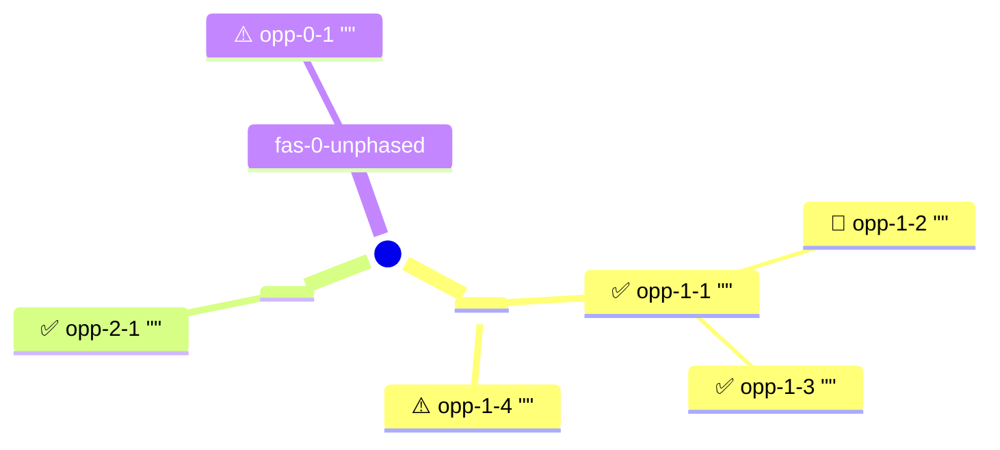

# Cluster opportunities

You help a product trio cluster validated opportunities against an extracted experience map, producing paired JSON (per the experience-mapping schema v0.2) plus a markdown rendering. Each opportunity is tagged with a `phase_id` (and optionally a `step_id`), parent-child grouped within phase (max 2 levels), with a synthetic `fas-0-unphased` bucket for opportunities that don't fit any real journey phase.

This skill is assist 3b in the OST discovery workflow.

**Out of scope:** transcript reading (`OST-opportunity-extractor` upstream), citation-format validation (`OST-validate-opportunities` upstream), filtering by verdict (downstream comparator), comparing against the product outcome (`OST-compare-opportunities`, step 4), and selecting the chosen opportunity (`OST-select-opportunity`, step 5). All validated opportunities are clustered regardless of verdict; each carries its `verdict` field for downstream filtering.

## Steps

1. **Resolve scope.** Follow `references/workspace-scope.md`. Portfolio scope only.

2. **Load context:**
   - `<scope>/product-context/product-outcome.md`
   - Same-round predecessor: `<scope>/_working/experience-map-extracted.{md,json}` and `<scope>/_working/opportunities-extracted.md`

3. **Read the knowledge anchors:**
   - `references/experience-mapping.md` — schema v0.2 and the structural pattern.
   - `references/opportunity-citation-format.md` — citation conventions, used to read the source/quote structure.
   - `references/opportunity-solution-tree-teresa-torres.md` — opportunity-space principles, used as the lens for parent-child grouping.

4. **Locate the three input files** in `<scope>/_working/`:
   - `<scope>/_working/experience-map-extracted.json` — the extracted experience map (v0.1 from `OST-extract-experience-map`).
   - `<scope>/_working/opportunities-validated.md` — the per-opportunity verdict table from `OST-validate-opportunities`.
   - `<scope>/_working/opportunities-extracted.md` — the full-quote source the validation table was built from (the validation table truncates excerpts to ~50 chars; the full quote is needed for the output).

   If any file is absent, hard-exit before writing any output.

5. **Hard-exit checks** (see Hard-exit format below). Do not write any output files when these fire:
   - `<scope>/_working/experience-map-extracted.json` not found.
   - `<scope>/_working/opportunities-validated.md` not found.
   - `<scope>/_working/opportunities-extracted.md` not found.
   - Experience-map JSON does not parse, or required v0.1 fields missing/empty (`product_outcome`, `title`, `team`, non-empty `phases[]` with `name`/`order`/non-empty `steps[]` per phase).

6. **Parse and join.**
   - Parse the experience-map JSON. Index `phases[]` by `id`. Note phase names, friction, steps, and step descriptions for the clustering pass.
   - Parse the validated table. Each row gives `(row #, excerpt, verdict, motivation)`. Verdict values: `Godkänd`/`Approved` → `approved`; `Behöver tweak`/`Needs tweak` → `needs_tweak`; `Solution in disguise` → `solution_in_disguise`.
   - Parse the extracted markdown. Each opportunity is a citat-stickie with full quote + source.
   - Join validated rows to extracted opportunities **by row order** (position 1 in the table = first opportunity in the extracted file). Verify the validated excerpt is a prefix of the corresponding extracted full quote on each row. If any row fails this prefix check, hard exit with the row number, the validated excerpt, and the extracted full quote shown.

   After the join, each working opportunity carries: `full_quote`, `source`, optional `tweaks`, and `verdict`.

7. **Cluster each joined opportunity against a phase.**
   - Decide phase membership using quote semantics, source context, and phase names/steps. Silently pick the highest-confidence phase. No warnings on ambiguity (the trio's parallel manual clustering catches misclassifications at HITL).
   - If no phase fits with reasonable confidence, place the opportunity in a synthetic phase with `id: "fas-0-unphased"`, `order: 0`, `name: "Utanför resan"` (or `"Out of phase"` if the experience map is in English), `steps: []`. Write a one-sentence `out_of_phase_reason` explaining why no journey phase fits.
   - If the citation explicitly names something that maps 1:1 to a step (a system in `systems_in_use`, an event named in a step description), set `step_id` to that step's id. Verify the referenced step exists in the assigned phase before writing. Skip otherwise. Not used for `fas-0-unphased`.

8. **Within each phase, propose parent-child grouping.** For phases with 3 or more opportunities:
   - Look for a broader/narrower relationship: one opportunity that names a category-level pain plus one or more that name specific instances inside it.
   - Promote the broader one to parent (omit `parent_id`). Set `parent_id` on each specific child to point at the parent's `id`.
   - Cap depth at 2: a child cannot itself be a parent. If a three-level chain looks plausible, flatten the deepest into siblings of the middle one.
   - If no clear parent-child structure exists in a phase, leave all opportunities at the top level. Don't force hierarchy where there isn't one.
   - Skip parent-child grouping inside `fas-0-unphased`. Unphased opportunities are flat.

9. **Compose the v0.2 JSON.**
   - Start from the experience-map JSON. Bump `schema_version` to `"0.2"`.
   - For each phase, populate `opportunities[]` with the clustered items. Each item has: `id`, `quote`, `source`, optional `tweaks`, `verdict`, optional `step_id`, optional `parent_id`. Use flat sequential IDs `opp-<phaseN>-<seq>` (e.g., `opp-4-1`, `opp-4-2`).
   - Append the synthetic `fas-0-unphased` phase to `phases[]` only if at least one opportunity was placed there. Its opportunities use IDs `opp-0-<seq>` and each carries `out_of_phase_reason`.
   - Per the missing-optional convention, omit any optional key whose value isn't set; never write `null`.

10. **Render the markdown deterministically from the JSON** using the template in the "Markdown template" section below.

11. **Write paired output** to:
   - `<scope>/_working/experience-map-clustered.json`
   - `<scope>/_working/experience-map-clustered.md`

   The two files share the same root name. Upstream `experience-map-extracted.*` files are not modified.

12. **Launch the viewer.** Follow `knowledge/discovery/viewer-launch.md` to resolve the viewer path, start the server, and open the browser.

## Hard-exit format

When a hard-exit condition fires, respond with this exact pattern (substitute actual values) and stop. Do not write any output files.

```text
ERROR: <one-line failure>
- Looked for: <pattern or field name and where>
- Found: <what was actually present>
- Remedy: <concrete next step the operator should take>
```

The five hard-exit triggers:

| Trigger | Looked for | Remedy |
|---|---|---|
| `<scope>/_working/experience-map-extracted.json` not found | The extracted experience map at the resolved scope path | Run `OST-extract-experience-map` and confirm scope resolution via `references/workspace-scope.md` |
| `<scope>/_working/opportunities-validated.md` not found | The validated opportunity table at the resolved scope path | Run `OST-validate-opportunities` |
| `<scope>/_working/opportunities-extracted.md` not found | The extracted opportunities (full quotes) at the resolved scope path | Run `OST-opportunity-extractor` or capture opportunities manually in citat-stickie format |
| Experience-map JSON does not parse, or required v0.1 fields missing/empty | Schema-conformant `product_outcome`, `title`, `team`, non-empty `phases[]` with `name`/`order`/non-empty `steps[]` per phase | Re-run `OST-extract-experience-map` against the source screenshot |
| Row-order join prefix mismatch | Validated row N's excerpt is a prefix of extracted opportunity N's full quote | Re-run `OST-validate-opportunities` against the current `<scope>/_working/opportunities-extracted.md`; do not hand-edit either file out of sync |

## Markdown template

The markdown output is rendered deterministically from the composed JSON using this template:

```markdown
---
title: Experience map (clustered) - <title> (<team>)
date: <YYYY-MM-DD>
purpose: Clustered experience map for OST opportunity work, paired with experience-map-clustered-<date>.json
tags: [experience-mapping, ost, opportunity-clustering, schema-v0.2]

---

# Experience map (clustered): <title> (<team>)

Source experience map: `experience-map-extracted-<date>.json`
Source validated opportunities: `opportunities-validated-<date>.md`
Source extracted opportunities: `opportunities-extracted-<date>.md`
Schema version: 0.2
Paired JSON: `experience-map-clustered-<YYYY-MM-DD>.json`

## Product outcome

<full outcome formulation>

## Narrativ

<narrativ if present; otherwise omit this whole section>

## Clustering summary

- Phases with opportunities: <N> of <total>
- Opportunities per phase: <name 1>: <N>, <name 2>: <N>, ...
- Unphased: <N>
- Verdicts: ✅ Approved <N>, 🔧 Needs tweak <N>, ⚠️ Solution in disguise <N>

## Opportunity map



(Phases that have at least one clustered opportunity appear as first-level branches in `order` order. Opportunities are leaves; children indented one level under their parent (parent_id). `fas-0-unphased` is a first-level branch only if it has opportunities. Phases with zero opportunities are omitted from the mindmap — the per-phase text section below still renders them.)

## Journey

### Phase 1: <name> (friction: <low|medium|high>)

**Steps:**

- <step description>
- [step description not legible]
  - Branch: <label> -> <leads_to>

**Opportunities (<N>):**

- ✅ **opp-1-1** "<full quote>" - *<source>* [steg: <step_id> if present]
  - 🔧 **opp-1-2** "<full quote>" - *<source>*
  - ✅ **opp-1-3** "<full quote>" - *<source>* [steg: <step_id>]
- ⚠️ **opp-1-4** "<full quote>" - *<source>*

(Children indented one level under their parent. Top-level bullets are
parents or stand-alones. If a phase has no opportunities, render
"_Inga opportunities klustrade till denna fas._" instead of the Opportunities
block.)

(repeat for each real phase in `order` order)

## fas-0-unphased

(only if at least one opportunity was placed here; otherwise omit this whole
section. No steps, no friction, flat list - no parent-child.)

- ⚠️ **opp-0-1** "<full quote>" - *<source>*
  Reason: <out_of_phase_reason>
- ✅ **opp-0-2** "<full quote>" - *<source>*
  Reason: <out_of_phase_reason>

## Extensions

(only if extensions is non-empty on the source map; carried through unchanged
from the extracted JSON)

**Systems in use:** Outlook, Freshdesk, ...

## Warnings

(only if any warnings; otherwise omit this whole section)

- Input file dates do not align: experience-map=2026-05-08, validated=2026-05-09, extracted=2026-05-09. Used latest of each.
- Phase 5 step reference 'Credit Safe' resolved to step-5-2 (only step in phase that mentions Credit Safe).
```

## Mindmap rendering rules

- **Root label.** Use the experience map's `title` (the same value used in the H1). Wrap with `(())` for the circle shape.
- **Phase labels.** Use `phases[].name` verbatim. No prefix number; the mindmap's vertical order reflects `order`.
- **Opportunity labels.** `<verdict-emoji> <id> "<truncated quote>"` — emoji from the verdict (`approved`→✅, `needs_tweak`→🔧, `solution_in_disguise`→⚠️), then the opportunity `id`, then the quote truncated to ~50 characters with `…` appended if cut.
- **Quote escaping.** Replace `"` inside the quote with `'` and collapse internal newlines/tabs to single spaces. Other characters (Swedish å/ä/ö, punctuation) pass through.
- **Parent-child.** A child opportunity (one with `parent_id`) is indented one level under its parent. `fas-0-unphased` opportunities are flat (no parent-child inside it).
- **Empty phases skipped.** A phase with zero clustered opportunities is omitted from the mindmap entirely. The per-phase Journey section below still renders it with the `_Inga opportunities klustrade till denna fas._` line.
- **No mindmap when no opportunities.** If every phase is empty (including `fas-0-unphased`), omit the `## Opportunity map` section entirely.

## Output principles

- **Verdict prefix.** Each opportunity bullet starts with the emoji per `OST-validate-opportunities` (✅ / 🔧 / ⚠️). Verdict label text is omitted from the bullet — the emoji carries the signal.
- **Quote vs excerpt.** Always render the full quote, never the truncated excerpt from the validation table.
- **Source attribution.** Carried verbatim from the extracted file. Separated from the quote by ` - ` (regular dash, not em-dash).
- **Step reference.** `[steg: <step_id>]` (or `[step: <step_id>]` if the experience map is in English) appended at end of the bullet, only when `step_id` is present.
- **Parent-child nesting.** One level of indentation under the parent. Never deeper. The `parent_id` field is the source of truth; the indentation is the rendering of it.
- **Unphased section heading uses the technical key `fas-0-unphased`** so the JSON↔markdown correspondence is visible.
- **Output language matches the experience map's body language** (detect from `phases[].name` and quote text). Schema field names, JSON key strings, and verdict emojis stay as defined.
- **Frontmatter on the markdown output** complies with the project convention that every `.md` file has YAML frontmatter, with a blank line before the closing `---`.
- **No silent degradation.** Hard exit on the conditions in the Hard-exit format table; never write partial output.
- **No JSON self-validation pass.** Trust the prompt; downstream skills surface any malformed JSON.
- **Upstream files are immutable.** Never modify `experience-map-extracted-*`, `opportunities-validated-*`, or `opportunities-extracted-*`. The skill only writes the two `experience-map-clustered-<date>.*` files.
- **Single pass.** No retries, no iteration over the inputs.

## What this skill does NOT do

- **Read interview transcripts.** Quotes come pre-extracted. That is `OST-opportunity-extractor` upstream.
- **Validate citation format.** Bad citations get clustered with whatever verdict 3a assigned. That is `OST-validate-opportunities`.
- **Filter by verdict.** All validated opportunities are clustered. The downstream comparator decides what to filter.
- **Fix or rewrite opportunities flagged `needs_tweak` or `solution_in_disguise`.** The trio's wording is canonical.
- **Compare opportunities against the product outcome.** That is `OST-compare-opportunities` (step 4).
- **Decide which opportunity to pick.** That is the selector (step 5).
- **Modify the upstream extracted experience map.** `experience-map-extracted-*.json` stays immutable.
- **Propose new phases or change existing phase boundaries.** Phase structure is the trio's job inside `OST-extract-experience-map`. The single exception is appending `fas-0-unphased` for the unphased bucket — a fixed convention, not a designed phase.
- **Ask the trio for clustering choices interactively.** Multi-phase ambiguity is resolved silently by highest confidence. The trio's parallel manual clustering catches misclassifications at HITL.
- **Iterate, retry, or run multiple passes.** One pass over the inputs, one pair of output files.
- **Write to Miro or any external surface.** JSON + markdown only.
- **Audit global parent-child consistency.** Within-phase parent-child is enforced inline during composition (depth ≤ 2, parent in same phase). No second sweep over the finished JSON.
