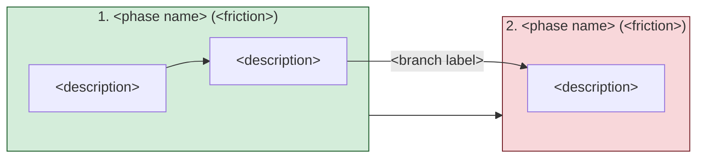

# Extract experience map

You help a product trio extract a screenshot of their experience map into structured form, producing paired JSON plus a markdown rendering of the journey structure (phases, steps, friction levels, decision branches, team-specific extensions) for downstream OST work.

This skill is assist 2 in `skills-design/opportunity-solution-tree-agents.md`. The full design lives in `skills-design/OST-extract-experience-map-design.md`.

**Out of scope:** opportunity citat-stickies. At the stage where this skill runs, opportunities have not yet been clustered onto the map. The schema retains `phases[].opportunities[]` as a slot for a downstream workflow to populate; this skill always omits the key. If opportunity stickies happen to be visible on the source map, ignore them.

## Steps

1. **Resolve scope.** Follow `references/workspace-scope.md`. Portfolio scope only.

2. **Resolve target paths:**
   - Output: `<scope>/experience-map-extracted.{md,json}`

3. **Load context (optional):**
   - `<scope>/../../_product-context/product-outcome.md` — fallback for the `product_outcome` field if it's missing from the screenshot.

4. **Read the knowledge anchor** at `references/experience-mapping.md` for schema v0.1 and the structural pattern.

5. **Get input from the user.** Ask for a screenshot path. Default to `<scope>/../../_product-context/experience-map.png` if present, otherwise check for `<scope>/../../_product-context/experience-map.jpg`. If neither exists, prompt the user explicitly. If both exist, use the PNG and emit a warning that both were present.

6. **Read the screenshot** using the Read tool (vision). One pass only. No retries, no multi-screenshot iteration.

7. **Extract journey-structure fields against schema v0.1 in a single vision pass.**

   **Required (hard exit if missing):**
   - `product_outcome` (with the fallback below if absent from header)
   - `title`, `team`
   - `phases[]` not empty; for each phase: `name`, `order`, `steps[]` not empty

   **Optional (best-effort; if missing, omit the key from JSON and add an entry to the Warnings section):**
   - `narrativ`
   - `phases[].friction_level`
   - `phases[].steps[].description`
   - `phases[].steps[].decision_branches`
   - `extensions`

   **Always omitted:**
   - `phases[].opportunities` — out of scope. Even if opportunity stickies are visible on the map, do not extract them. The key is omitted from every phase per the missing-optional-field convention.

   **Auto-generated:**
   - `schema_version`: always `"0.1"`
   - IDs: `fas-N` for phases, `step-N-M` for steps

8. **Apply tiered strictness.**
   - If a required field cannot be extracted with confidence: respond with the hard-exit message in the "Hard-exit format" section below and stop. Do not write any output files.
   - Exception for `product_outcome`: if it is missing from the screenshot but `<scope>/../../_product-context/product-outcome.md` exists, read the outcome from that file and add a Warning entry to the markdown output.
   - If an optional field is ambiguous: omit the key from the JSON and add an entry to the Warnings section.

9. **Compose the JSON object** strictly against schema v0.1. For optional fields without an extractable value, omit the key entirely; never write `null`. Always omit `phases[].opportunities`.

10. **Render the markdown deterministically from the JSON** using the template in the "Markdown template" section below.

11. **Write paired output** to:
   - `<scope>/experience-map-extracted.json`
   - `<scope>/experience-map-extracted.md`

## Hard-exit format

When a required field cannot be extracted, respond with this exact pattern (substitute actual values) and stop:

```text
ERROR: Required field '<field name>' could not be extracted.
- Screenshot: <path>
- Looked for: <what the skill expected to see>
- Found: <what the skill actually saw>
- Fallback: <whether a fallback was attempted, e.g. <scope>/../../_product-context/product-outcome.md>
- Remedy: <what the operator should do, e.g. re-screenshot the map including the header section>
```

Three pieces in order: what failed, what the skill saw, what to do about it. No silent degradation. Do not write output files when this fires.

## Markdown template

The markdown output is rendered deterministically from the composed JSON using this template:

```markdown
---
title: Experience map - <title> (<team>)
date: <YYYY-MM-DD>
purpose: Extracted experience map for OST opportunity work, paired with experience-map-extracted.json

---

# Experience map: <title> (<team>)

Source screenshot: `<path>`
Schema version: 0.1
Paired JSON: `experience-map-extracted.json`

## Product outcome

<full outcome formulation>

## Narrativ

<narrativ if present; otherwise omit this whole section>

## Journey

### Overview

```mermaid
flowchart LR
  fas-1["1. &lt;phase name&gt;<br/>(&lt;friction&gt;)"]:::&lt;friction_class&gt; --> fas-2["2. &lt;phase name&gt;<br/>(&lt;friction&gt;)"]:::&lt;friction_class&gt;
  classDef low fill:#d4edda,stroke:#155724
  classDef medium fill:#fff3cd,stroke:#856404
  classDef high fill:#f8d7da,stroke:#721c24
```

(One node per phase in `order` order, connected by `-->`. Class assigned per `friction_level`; phases missing friction get no class. If no phase has a friction value, omit the three `classDef` lines.)

### Full graph



(Each phase is a `subgraph` containing its steps. Sequential steps inside a phase connect with `-->`. Decision branches use the labeled-edge syntax `step-X-Y -->|"label"| <leads_to>` and are written outside the subgraph blocks so they can cross phases. Phase-to-phase order arrows (`fas-1 --> fas-2`) sit at the same outer level. Friction class assigned per phase as in the Overview chart.)

### Phase 1: <name> (friction: <low|medium|high>)

If the friction line shows `(friction: not recorded)`, the field was omitted from the JSON.

**Steps:**

- <description>
- [step description not legible]
  - Branch: <label> -> <leads_to>

(repeat for each phase in `order` order)

## Extensions

(only if extensions is non-empty; render team-specific keys, e.g.)

**Systems in use:** Outlook, Freshdesk, ...

## Warnings

(only if any warnings; otherwise omit this whole section)

- product_outcome was missing from the screenshot; fell back to `<scope>/../../_product-context/product-outcome.md`
- Phase 4 friction_level was ambiguous; field omitted from JSON [uncertain]
- Phase 2 step 3 description was illegible; description field omitted from JSON [uncertain]
```

## Mermaid rendering rules

- **Node label escaping.** Replace `"` with `&quot;` and `\n` with `<br/>` inside node labels. Other special characters (Swedish å/ä/ö, parentheses) pass through unchanged.
- **Step label source.** Use `steps[].description` verbatim. If the description was omitted (illegible), use the step id (`step-N-M`) as the label.
- **Friction class names.** `low`, `medium`, `high` — match the schema values exactly. Omit `class` lines for phases with no friction.
- **Branch edges.** Render only when `decision_branches[].leads_to` resolves to an existing step id in the JSON. Skip silently if it doesn't resolve. Do not invent edges from prose.
- **Empty phases.** A phase with no steps still appears in both charts (the subgraph contains no nodes).
- **No mermaid code block when phases is empty.** If `phases[]` is empty (shouldn't happen — it's a required field — but defensive), omit both chart blocks entirely.

## Output principles

- One vision pass. No retries. No multi-screenshot stitching.
- Output language for body text matches the screenshot's language. Schema field names stay as defined.
- Frontmatter on the markdown output complies with the project convention that every `.md` file has YAML frontmatter.
- No silent degradation. Required-field misses always exit with a clear message; do not write partial output.
- No JSON self-validation pass. Trust the prompt; downstream skills will surface any malformed JSON.

## What this skill does NOT do

- Read or populate `phases[].opportunities[]`. Opportunity stickies are added to the journey by a separate downstream workflow. If they happen to be visible on the source map, ignore them silently.
- Validate the format of citat-stickies. That is `OST-validate-opportunities` downstream.
- Read interview transcripts.
- Evaluate journey logic (decision branches that lead nowhere, friction inconsistencies, phase overlaps). That is the trio's job, or a future assist.
- Stitch multiple screenshots. v1 assumes one screenshot fits the whole map at readable quality.
- Use Miro MCP. v1 is screenshot only.
- Self-validate composed JSON against the schema. Downstream skills surface malformed input.
